# Allur — цифровой двойник автомобильного завода

Кейс №2 Qostanai Industry Hackathon (АО «Группа компаний АЛЛЮР»). Интерактивная 3D-модель завода Allur
в Костанае (ул. Промышленная, 41), показатели производства, центр решений, сценарная симуляция смены
и управление контроллерами линий через SCADA/HMI.

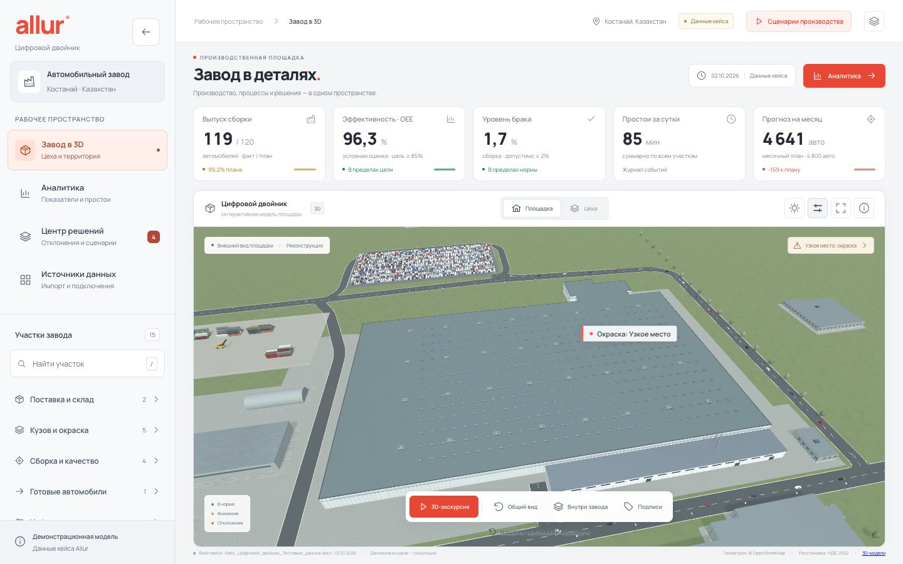

Двойник отвечает на три вопроса руководителя: **что происходит на заводе**, **где он теряет автомобили**
и **что даст каждое решение** — в штуках за месяц, а не в процентах.

Документация: [журнал изменений](docs/CHANGELOG.md) · [SCADA и HMI](docs/SCADA.md) · [материалы кейса](docs/case/) (условие и тестовые данные организаторов).

## Содержание

- [Что внутри](#что-внутри)
- [Сценарии использования](#сценарии-использования)
- [Экраны](#экраны)
- [Архитектура](#архитектура)
- [Данные и расчёты](#данные-и-расчёты)
- [Центр решений](#центр-решений)
- [Сценарии производства](#сценарии-производства)
- [SCADA и HMI](#управление-контроллерами-scada-и-hmi)
- [ИИ-аналитик](#ии-аналитик)
- [Администрирование](#администрирование)
- [3D-сцена](#3d-сцена)
- [Запуск](#запуск)
- [Проверки](#проверки)
- [API](#api)
- [Структура кода](#структура-кода)
- [Ограничения](#ограничения)
- [Источники](#источники)

## Что внутри

- **Площадка с географической привязкой.** Контур главного корпуса (360 × 227 м, 85 197 м²), территории и
  соседних зданий взят из OpenStreetMap. Земля, покрытия, подъезды, бордюры и озеленение построены объёмной
  геометрией и локальными материалами. Положения открытых площадок сохранены, а дороги и благоустройство —
  иллюстративная реконструкция, не геодезический план.
- **Расстановка цехов — по документу завода.** В проекте нормативов допустимых выбросов (НДВ)
  ТОО «СарыаркаАвтоПром» 2022 года (публичные слушания на ecoportal.kz) у каждого из 48 источников выбросов
  указаны цех и координаты на карте-схеме. Карта-схема привязана к спутниковому снимку (OpenCV), точность ≈10–15 м.
  Так определены положения ЦСК (сварка), ЦОК (окраска, печи ED / грунта / базы и лака), цеха окраски пластика,
  концов сборочных линий Chevrolet и Kia (ТРК), ЦМУС, ЦУД, ЦСКТ, РИЦ, лаборатории и котельной.
  Результат привязки — `backend/app/data/ndv_sources.json`. Цеха без выбросов (склад CKD, ОТК, буфер кузовов)
  размещены по технологической логике; в карточке цеха видно, на чём основано его положение.
- **Оборудование:** 4 сварочные линии (лазерная сварка крыши Onix), 13 ванн окраски (№10 — катафорез),
  кабины грунта, эмали и лака, печи, окраска пластика (6 роботов), конвейер на 59 постов, ОТК
  (сход-развал, фары, тормозной стенд, дождевальная камера, световой туннель). Это реконструкция по описаниям
  технологического процесса, не заводские CAD-модели.
- **Живой поток:** кузова тактово идут по сварке, окунаются в ванны, меняют цвет при окраске, на сборке получают
  стёкла и колёса, проходят ОТК и уезжают на площадку. Автомобили — авторские GLB-модели Onix и Cobalt с тремя
  уровнями детализации.
- **KPI по данным кейса:** план/факт, загрузка, условный OEE, брак и простои; цели — OEE ≥ 85 %, брак ≤ 2 %.
- **Центр решений:** узкое место, потери в автомобилях, прогноз месяца, мероприятия с эффектом и сценарий «что если».
- **Источники данных:** файл кейса, импорт выгрузок MES/1С, живой симулятор линии, путь к ПЛК.
- **Сценарии производства:** дискретно-событийная модель смены — отказ конвейера, очереди, ремонт, сравнение сценариев.
- **Карточка машины:** клик по любому автомобилю в сцене — VIN, модель, цвет, заказ, участок и этап, сроки, что мешает.
- **SCADA/HMI:** управление 12 контроллерами линий по PackML через OPC UA, тревоги по ISA-18.2, журнал аудита,
  пульт оператора `/hmi.html`; тревоги ПЛК видны на 3D-модели. Устроено как на заводе: шкафы управления с ПЛК
  и 125 полевыми сигналами на клеммах, центральный сервер с базой тегов и экран диспетчерской с командами линии.
- **ИИ-аналитик:** прогноз отказов по трендам датчиков за десятки минут до аварии ПЛК, детектор аномалий режима,
  модель причин брака, вероятность выполнить план (Монте-Карло) и ассистент на OpenAI с инструментами только для чтения;
  прогнозы видны на 3D-модели и на пульте HMI.
- **3D-экскурсия** из 16 шагов с автопереходом; прямая ссылка на шаг: `?step=5`.
- **Админка** `/admin.html`: статистика с графиками, управление данными и симулятором, цели и допущения расчётов,
  правки паспорта завода для 3D-модели, пользователи и роли, журнал действий.

## Сценарии использования

| Роль | Задача | Где в двойнике | Что получает |
|---|---|---|---|
| Директор по производству | Утром понять, выполняется ли план месяца и что мешает | Центр решений | Прогноз 4 641 авто при плане 4 800, узкое место — окраска, список отклонений, эффект каждого мероприятия в автомобилях |
| Начальник цеха | Найти, где теряется выпуск, и проверить оборудование у лимита простоя | Завод в 3D → карточка участка, Аналитика | Подсветка участка на модели, OEE и брак по дням, журнал простоев, риск оборудования и рекомендуемое действие |
| Мастер смены | Увидеть, что остановилось прямо сейчас | 3D-модель, живой поток, HMI | Метка «Простой: Камера-02» над цехом, ход смены по участкам, тревога ПЛК с причиной |
| Оператор линии | Запустить, остановить или сбросить контроллер, квитировать тревогу | Пульт `/hmi.html` | Панель контроллера PackML с проверкой блокировок, вторым шагом подтверждения и журналом аудита |
| Планировщик | Оценить, хватит ли мощности на цель 5 500 | Центр решений → «Что если» | Мощность при плановом такте 5 040, сколько доп. смен нужно, перевод эффекта в тенге по заданной марже |
| Инженер по надёжности | Проверить, что даст ускорение ремонта конвейера | Сценарии производства → «Что если?» | Сравнение ремонта 55 и 20 минут: 113 → 122 годных за смену, месяц 5 327 → 5 769, экономика |
| Логист / отдел продаж | Узнать, где конкретная машина и когда уедет дилеру | Клик по машине в 3D | VIN, заказ, этап, плановая отгрузка, просрочка и причина задержки |
| Аналитик данных | Подключить реальные данные без интеграции | Источники данных | Шаблон XLSX, импорт выгрузки MES/1С, автоматический пересчёт KPI и решений |
| Администратор | Задать цели и допущения, поправить паспорт завода, завести пользователей | Админка `/admin.html` | Графики по участкам, контроль SCADA и симулятора, настройки, редактор участков 3D-модели, роли, аудит |

### Как это работает на смене

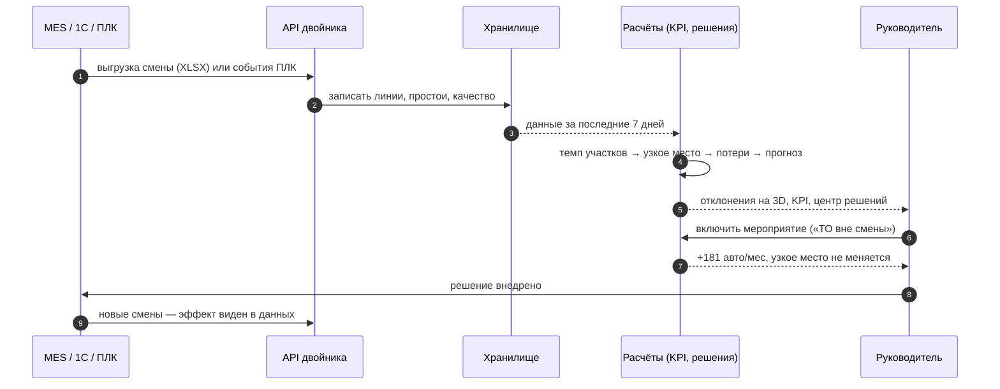

### Демо-сценарий на пять минут

1. **Завод в 3D.** Корпус и цеха стоят по спутнику и документам НДВ; над окраской — метка «Узкое место».
2. **Центр решений.** Завод теряет 399 авто в месяц на окраске. Включаем «Плановые работы — вне смены»: +181 авто.
   Включаем «Брак окраски до 2 %»: +63, и узкое место переходит на сварку. Снижение брака сварки отдельно даёт 0:
   двойник показывает, куда *не* стоит вкладываться ради объёма.
3. **Источники данных → «Запустить live».** Смена проходит за 24 секунды, на модели загорается «Простой: Камера-02»,
   после смены прогноз пересчитывается.
4. **Сценарии производства → «Показать отказ».** Конвейер-03 встал, буфер перед сборкой заполняется, окраска
   блокируется, ОТК без подачи; «Что если?» сравнивает ремонт за 55 и 20 минут.
5. **Пульт HMI.** Оператор видит тревогу, квитирует её, перезапускает конвейер; тревога ПЛК одновременно видна на 3D-модели.

## Экраны

| | |
|---|---|
| 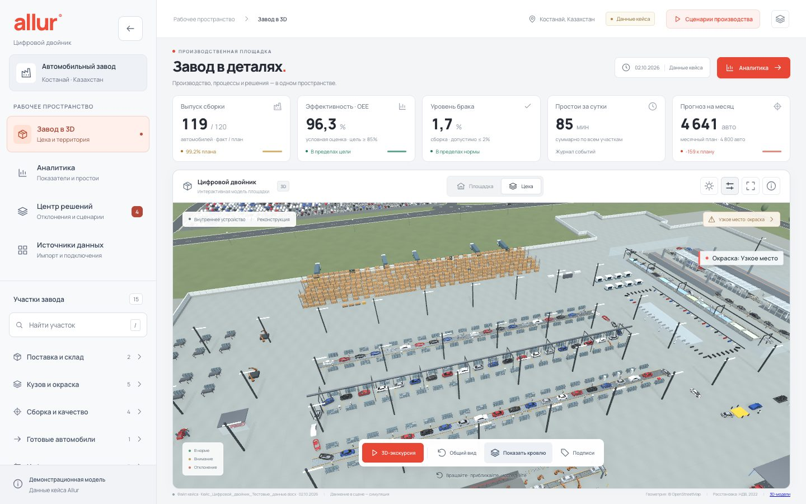 **Внутри корпуса.** Кровля снята: линии, роботы, конвейер на 59 постов, ОТК; метки отклонений над цехами. | 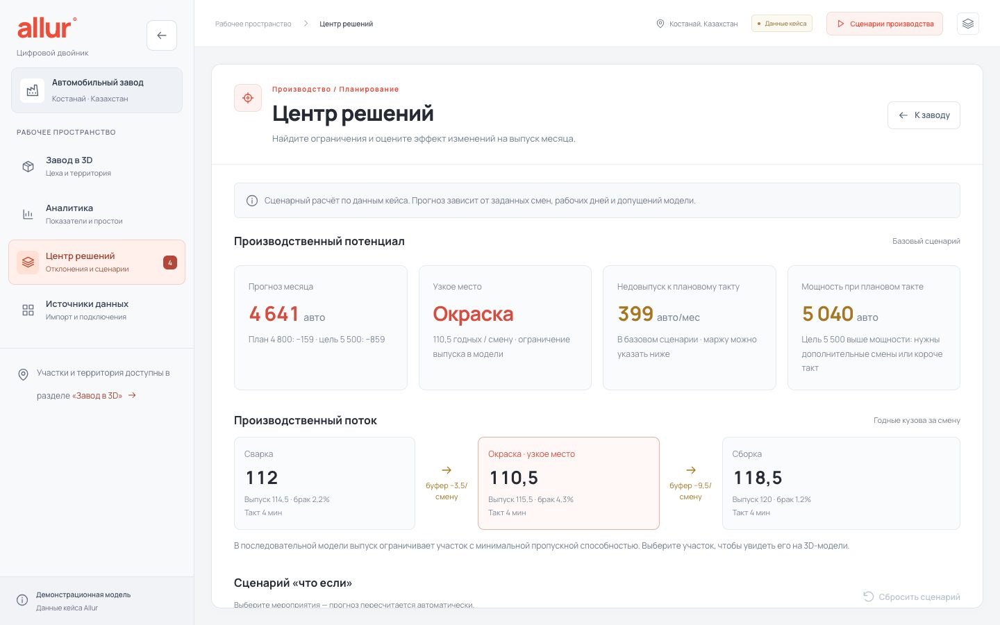 **Центр решений.** Прогноз месяца, узкое место, недовыпуск, мощность; поток по участкам и сценарий «что если». |
| 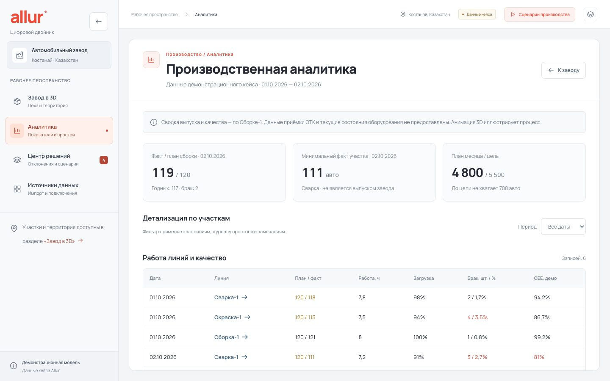 **Аналитика.** Таблицы линий и качества, журнал простоев, план месяца, методика расчётов и неоднозначности данных. | 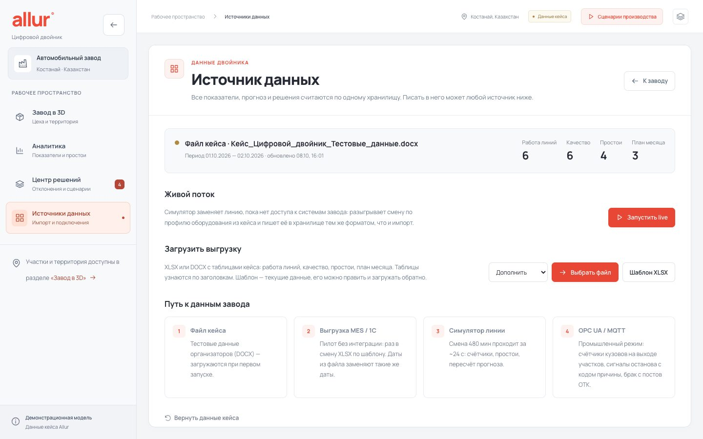 **Источники данных.** Откуда данные сейчас, живой симулятор, импорт XLSX/DOCX, шаблон, путь к ПЛК. |
| 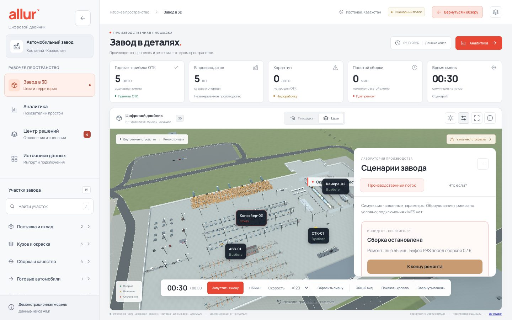 **Сценарии производства.** Отказ Конвейера-03: сборка остановлена, буфер PBS заполняется, состояния оборудования в 3D. | 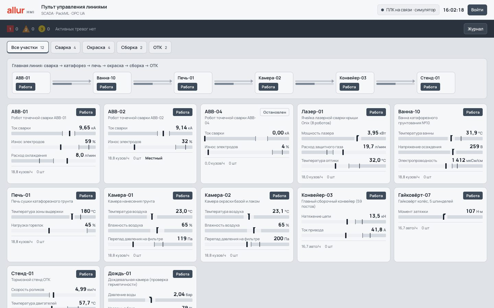 **Пульт HMI.** Лента тревог, схема линии, плитки 12 контроллеров с параметрами и состоянием PackML. |

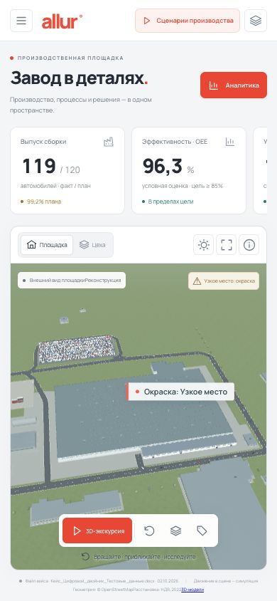

**На телефоне** интерфейс сворачивается в одну колонку: показатели — горизонтальной прокруткой, навигация —
кнопкой меню, 3D-сцена управляется жестами. Проверены 1440 × 900, 1024 × 768, 1440 × 560 и 390 × 844.

<br clear="all">

## Архитектура

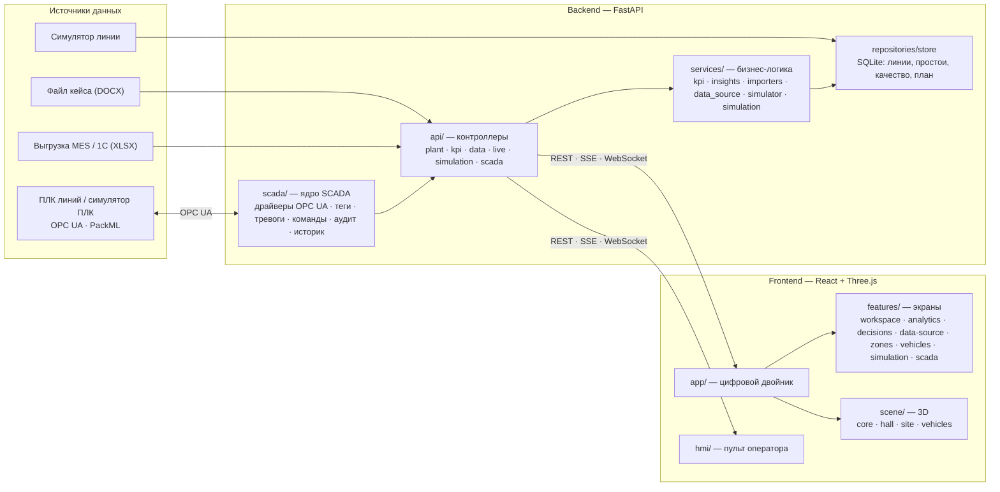

Правило зависимостей: контроллеры вызывают сервисы, сервисы — хранилище; экраны фронтенда пользуются `shared/`
и не зависят друг от друга; 3D-сцена ничего не знает об экранах. Любой новый источник данных (например,
коннектор OPC UA для записи смен) пишет в то же хранилище, и все расчёты работают без изменений.

### Как считается решение

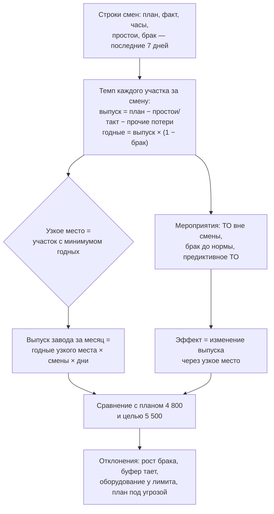

## Данные и расчёты

Все расчёты читают одно хранилище (`backend/data/twin.db`, SQLite) из четырёх таблиц в формате кейса:
работа линий, простои, качество, план месяца. Писать в него может любой источник:

| Источник | Как попадает | Когда использовать |
|---|---|---|
| Файл кейса (DOCX) | при первом запуске и по `POST /api/data/reset` | демо на тестовых данных |
| Выгрузка MES / 1С (XLSX или DOCX) | `POST /api/data/import` (merge: даты из файла заменяют такие же даты) | пилот: ежедневная выгрузка без интеграции |
| Симулятор линии | `POST /api/live/start` — смена из 480 мин проигрывается за ~24 с и записывается в хранилище | live-демо: счётчики, простои, сдвиг узкого места |
| SCADA / ПЛК (OPC UA) | модуль SCADA читает ПЛК по PackML и управляет ими; запись смен в хранилище — следующий шаг | промышленная эксплуатация |

- `GET /api/data/template` — XLSX с листами «Работа линий», «Простои», «Качество», «План месяца», заполненный текущими
  данными. Его можно отредактировать и загрузить обратно; таблицы распознаются по заголовкам.
- `GET /api/stream` — Server-Sent Events: ход смены раз в секунду и `version`, которая растёт при каждой записи
  в хранилище — по ней интерфейс перечитывает KPI и решения.
- Расчёт узкого места и прогноза берёт последние 7 дней данных, поэтому при живом источнике выводы меняются.

Для реального завода путь такой: на пилоте — ежедневная выгрузка из MES/1С в формате шаблона; затем коннектор
OPC UA к ПЛК линий (счётчики кузовов на выходе участков, сигналы останова с кодом причины) и запись брака с постов ОТК.

### Как читать показатели

Раздел **«Аналитика»** показывает данные из файла [`docs/case/Кейс_Цифровой_двойник_Тестовые_данные.docx`](docs/case/) за 1–2 октября 2026 года.
Данные статические; движение автомобилей в сцене иллюстрирует технологический процесс.

- Верхняя панель показывает последнюю запись **Сборка-1**: 119 из 120 автомобилей, 2 дефекта (1,7 %).
  Это данные сборки; отдельного подтверждения выпуска ОТК нет.
- Минимальный факт среди линий — 111 на сварке. Он показан отдельно и не означает выпуск завода.
- Условный OEE = min(часы / 8, 1) × min(факт / план, 1) × (1 − дефекты / факт). Период записей при двух сменах
  не уточнён, идеальное время цикла отсутствует, поэтому это демонстрационная оценка. Неоднозначности рабочего
  времени и простоев видны в аналитике.
- Лимит 60 минут проверяется по сумме событий одного оборудования за день. Критичность оборудования в исходных
  данных не указана; результат проверки условный.
- Месячный план: Onix — 2500, Cobalt — 1800, J7 — 500; всего 4800 при цели 5500. Разница — 700 автомобилей.
  Месячного факта в файле нет.

## Центр решений

Логика двойника поверх данных кейса — модель последовательного потока: выпуск завода равен числу годных кузовов
на узком месте.

- **Узкое место** — окраска: 110,5 годных за смену при плане 120.
- **Прогноз месяца** — 4 641 авто при плане 4 800 и цели 5 500; мощность при плановом такте — 5 040, то есть цель
  выше мощности даже без потерь.
- **Недовыпуск** к плановому такту — 399 авто в месяц; при заданной марже переводится в тенге.
- **Мероприятия** с эффектом, рассчитанным через узкое место: вынос планового ТО из смены +181 авто/мес, брак окраски
  до 2 % +63 (после чего узкое место сдвигается на сварку), брак сварки отдельно — 0, предиктивное обслуживание отдельно — 0.
- **Сценарий «что если»:** набор мероприятий, число смен, рабочие дни, дополнительные смены в выходные, маржа на авто.
- **Отклонения** (узкое место, рост брака по дням, тающие буферы между участками, оборудование у лимита простоя,
  план под угрозой) — на 3D-модели, в списке участков и в карточке цеха.
- **Риск оборудования** и действие по причине простоя: Конвейер-03 (обрыв цепи, 55 из 60 мин) — высокий.

Допущения показаны в самом разделе: строка данных — одна смена, 21 рабочий день в октябре, брак — кузов, не прошедший
участок с первого раза, предиктивное обслуживание убирает половину внеплановых простоев.

### Вероятностный прогноз: сценарная студия

Расчёт по средним отвечает «сколько машин», но не «с какой уверенностью». Сценарная студия (`services/forecast.py`) —
единое ядро прогноза месяца для всего двойника: центр решений и сценарии производства берут месяц из неё.

- **Калибровка по данным.** Темп, брак и простои каждого участка — те же, что в расчёте по средним (без случайности
  модель даёт ровно 4 641 и те же эффекты мероприятий: +181, +63, 0). Отказы — по журналу простоев: частота на смену
  и длительность для каждой единицы оборудования (Конвейер-03 — 0,5 отказа за смену по 55 мин).
- **Монте-Карло.** Жидкостная модель потока «сварка → буфер → окраска → буфер → сборка» с шагом 2 мин, векторизованная
  по прогонам (NumPy): 300–400 месяцев со случайными отказами за ~0,5 с. Конечные буферы передают остановку соседям.
- **Ответ руководителю:** медиана 4 441 авто, 80 % прогонов — 4 374…4 503; вероятность плана 4 800 и цели 5 500 — 0 %;
  **цена нестабильности — 204 авто в месяц** (на столько случайные отказы и конечные буферы снижают выпуск относительно
  расчёта по средним); узкое место — окраска в 83 % прогонов, сварка в 17 %.
- **Что видит только модель с буферами.** По средним предиктивное ТО и быстрый ремонт конвейера дают 0 — сборка не узкое
  место. В студии они дают +93 и +129 авто/мес: отказ конвейера на 55 мин длиннее буфера и через него останавливает окраску.
- **Параметры надёжности:** ёмкость буферов, длительность внеплановых ремонтов, темп узкого места — поверх мероприятий
  и календаря сценария «что если».
- **«Что сильнее влияет»:** эффект каждого мероприятия на одних и тех же случайных отказах (общие случайные числа),
  с разбросом P10–P90, стоимостью и итогом при заданной марже.
- **«Как выйти на цель»:** перебор всех сочетаний мероприятий, проверка лучших кандидатов Монте-Карло и добор смен
  в выходные до заданной уверенности. Самый дешёвый план к 5 500 при 80 %: ТО вне смены, брак окраски до 2 %, быстрый
  ремонт и 6 смен в выходные — ≈ 87 млн ₸/мес, 5 570 авто в среднем. «Применить к сценарию» переносит план в расчёт.
- Стоимость мероприятий — оценки по умолчанию для демонстрации (`forecast.COSTS`), не данные Allur; передаются в запросе.

## Сценарии производства

Кнопка **«Сценарии производства»** открывает отдельное рабочее пространство. Это дискретно-событийная модель
с заданными параметрами, а не подключение к MES. Исторические числа из DOCX доступны через «Аналитику» и не изменяются.

1. **«Показать отказ»** переводит смену на 30-ю минуту: Конвейер-03 останавливается.
2. **«+15 мин»** показывает накопление кузовов в PBS, блокировку окраски и отсутствие подачи на ОТК.
3. **«К концу ремонта»** восстанавливает обработку с сохранённым прогрессом кузова.
4. **«Итог смены»** рассчитывает оставшееся время до 480-й рабочей минуты.
5. Вкладка **«Что если?»** сравнивает базовый и альтернативный ремонт за смену и месяц, объясняет распространение
   потерь и показывает экономическую оценку решения.

- Состояния оборудования: RUN, FAULT, BLOCKED, STARVED. Клик по карточке или маркеру показывает объект.
- Сервер — единственный источник времени, состояния кузовов и KPI. Кровля и камера не сбрасывают модель.
- WebSocket передаёт состояния каждые 0,5 секунды; при потере связи используется HTTP и переподключение.
- Каждый браузер получает отдельную сессию. Сессии находятся в памяти одного процесса API; перезапуск сервера
  сбрасывает их. Для этого MVP запускайте один worker.
- Четыре агрегированных ресурса и три конечных FIFO-буфера. Межцеховой транспорт мгновенный; маршрут внутри этапа
  визуализирует прогресс операции. Это не модель всех 59 постов.
- Такт, ёмкости, брак и длительность ремонта — сценарные значения. Начальный WIP нулевой, подача CKD не ограничена,
  позиции оборудования условные. Микс моделей: 25 Onix / 18 Cobalt / 5 J7.
- Месяц считает единое ядро прогноза (сценарная студия): медиана 300 прогонов, калиброванных по данным завода; меняется
  только длительность ремонта Конвейера-03. Поэтому месяц здесь совпадает с центром решений.
- Экономика за одну смену: изменение годного выпуска × заданный маржинальный доход − цена вмешательства.
  Это не выручка и не подтверждённая экономия Allur.
- При стандартных параметрах (seed 42, ремонт 55 → 20 мин): 113 → 122 годных за смену, 35 минут разницы простоя;
  месяц — 4 436 → 4 531 при 21 рабочем дне (медиана прогонов).

## Управление контроллерами: SCADA и HMI

Платформа управляет каждым ПЛК линии, а не только показывает данные. Подробно — в [docs/SCADA.md](docs/SCADA.md).

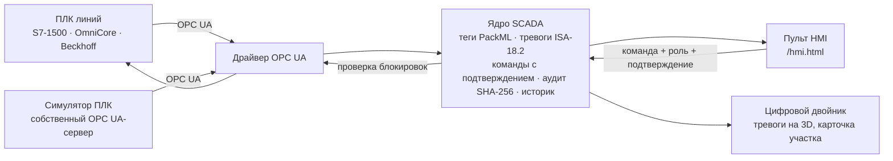

- **Пульт оператора** `/hmi.html` — лёгкая страница без 3D для панелей у линии (принципы ISA-101):
  лента тревог, схема линии с заполнением буферов, плитки 12 контроллеров, панель контроллера с командами,
  режимом, уставками, трендами и тревогами, журналы команд, аудита, простоев и связи.
- **Один интерфейс для любого оборудования — PackML** (ISA-TR88, OPC 30050) **по OPC UA**: состояние, режим,
  скорость, счётчики, код причины останова, ключ «Местный/Дистанционный», цепь безопасности, параметры и уставки.
  Реальный ПЛК подключается строкой в `backend/app/data/controllers.json`, старые протоколы — через OPC UA-шлюз.
- **Безопасность команд:** роли (наблюдатель, оператор, инженер АСУ ТП), проверка блокировок с объяснением причины,
  второй шаг подтверждения за 20 с для пуска, сброса, уставок и режимов, повторная проверка той же логики в ПЛК,
  подтверждение выполнения по обратной связи ПЛК, режим только чтения для ввода в эксплуатацию.
  Аварийные кнопки и ПЛК безопасности SCADA не трогает.
- **Тревоги по ISA-18.2** (приоритеты, квитирование, возврат в норму, отложение с причиной, подавление по состоянию)
  и **журнал аудита** с цепочкой SHA-256: правку задним числом видно сразу.
- **Симулятор ПЛК** публикуется настоящим OPC UA-сервером (`opc.tcp://127.0.0.1:4840/allur/plcsim`, к нему
  подключается и UaExpert). Участки связаны буферами: авария сборки через время буфера останавливает окраску,
  печь и сварку, а после ремонта линия поднимается сама.
- В карточке участка цифрового двойника — состояние его ПЛК, тревоги и переход в пульт; тревоги ПЛК окрашивают
  участок на 3D-модели и подписывают его («Сборка: Конвейер-03: обрыв цепи»).

Демо-учётки: `operator` / `operator`, `engineer` / `engineer`. Режим запуска — `SCADA_MODE`
(`opcua-sim` по умолчанию, `sim`, `plant`, `off`).

## ИИ-аналитик

Раздел «ИИ-аналитик» в двойнике и API `/api/ai/*`. Пять моделей работают поверх данных SCADA и показателей смен;
модели обучаются при запуске бэкенда в фоне (около 5 с), двойник доступен сразу.

| Что | Модель | Данные | Где видно |
|---|---|---|---|
| **Прогноз отказа** | тренд МНК по окну до 15 мин → время до аварийного порога ПЛК с интервалом; градиентный бустинг → вероятность выхода за порог в ближайший час | 24 000 синтетических траекторий износа (скорость, ускорение, шум, запас до порога), AUC 0,97 | карточки отказов, 3D, HMI |
| **Аномалии режима** | робастная ковариация (MCD), расстояние Махаланобиса по окну 2 мин: сдвиг среднего, наклон, разброс в единицах шума датчика | нормальная работа; порог — 0,01 % ложных окон, показ после 3 опросов подряд | лента аномалий, 3D, HMI |
| **Причины брака** | градиентный бустинг «режим процесса → брак кузова» для 9 узлов; важность перестановкой; порог, за которым брак удваивается | синтетические кузова по закону брака симулятора (`sim.quality` в `controllers.json`) | риск брака по участкам, главный фактор сейчас |
| **Вероятность плана** | Монте-Карло: 4 000 проигрышей месяца по сменам — бутстреп темпа, пуассоновские простои, биномиальный брак | данные смен окна | гистограмма, вероятность плана и цели, частота узкого места |
| **Ассистент** | OpenAI (`gpt-4.1`, вызов инструментов) с 9 инструментами чтения: показатели, решения, состояние ПЛК, прогнозы, история, сценарий | живые данные двойника | чат, сменный отчёт |

Брак в симуляторе ПЛК теперь зависит от режима: засоренный фильтр камеры, отклонение влажности и температуры,
износ электродов, температура ванны катафореза. Поэтому модель брака находит те же причины, что заложены в линию:
у Камеры-02 брак удваивается при перепаде на фильтре ≈ 236 Па.

**Проверено на симуляторе** (`backend/tests/test_ai.py`, линия в модельном времени): за 20–90 мин нормальной работы —
ни одной ложной аномалии; износ подшипника привода конвейера (ток +1,5 А/мин) замечен через 1,7 мин, тревога ПЛК —
через 9,8 мин, авария — через 18,8 мин; время до замены фильтра и колпачков совпадает с расчётным в пределах 1–3 мин.

**Демо.** В разделе «ИИ-аналитик» → «Проверить на симуляторе» запустите износ узла (подшипник конвейера, теплообменник
ванны, стекло лазера, двигатели тормозного стенда): через 1–2 мин появится аномалия, затем прогноз отказа с временем
и потерей в автомобилях, участок подсветится на 3D-модели и в полосе «Прогноз ИИ» на пульте HMI — раньше тревоги ПЛК.
«Отремонтировать» возвращает узел в норму. То же через API: `POST /api/ai/demo {"id": "bearing"}`.

**Ассистент.** Отвечает на вопросы руководителя и пишет сменный отчёт, сам вызывая инструменты двойника. Только чтение:
команды оборудованию подаёт оператор на HMI. Нужен ключ OpenAI: `OPENAI_API_KEY` в окружении или в файле
`backend/.env` (строка `OPENAI_API_KEY=sk-...`; файл в `.gitignore` и в репозиторий не попадает). Без ключа и при сбое
сети ассистент отвечает в офлайн-режиме — сводкой по правилам из тех же данных.

Переменные: `AI_MODE=off` — выключить модели, `AI_LLM=off` — только офлайн-ассистент, `AI_MODEL` — модель OpenAI (по умолчанию `gpt-4.1`).

## Администрирование

Отдельная страница `/admin.html` для администратора двойника; вход — учётная запись с ролью «Администратор»
(демо: `admin` / `admin`). Роли общие с пультом HMI; администратор — высшая.

- **Обзор** — плитки прогноза, узкого места, недовыпуска, OEE, брака и простоев; графики OEE и брака по участкам
  по дням с линиями целей, простои по причинам, годные кузова за смену с выделенным узким местом; состояние
  источника данных и SCADA. У каждого графика есть легенда, подсказка при наведении и табличный вид.
- **Производство** — отклонения, мероприятия с эффектом, риски оборудования, журнал простоев, сводка SCADA.
- **Данные** — источник, запуск и остановка живого симулятора, импорт XLSX/DOCX, шаблон, сброс к файлу кейса.
  Импорт, сброс и симулятор доступны только администратору: в двойнике эти действия работают при входе в админку
  в том же браузере, иначе показывается подсказка.
- **3D-модель** — паспорт завода: название, адрес, факты, для каждого участка корпуса — имя, короткое имя,
  KPI-участок, цвет, координаты `u0 u1 v0 v1` в системе корпуса, описание; для площадок — центр и размер.
  Правки хранятся отдельно от исходного паспорта по OSM и НДВ и накладываются сверху; «Сбросить к источникам»
  возвращает исходный. Двойник применяет правки при следующей загрузке страницы.
- **Настройки** — цели (OEE, брак, лимит простоя, выпуск, смены), допущения расчётов (рабочие дни, доля
  предотвращённых простоев, окно темпа, маржа на авто) и 3D-сцена по умолчанию. Цели и допущения сразу меняют
  KPI, отклонения и прогноз во всех разделах двойника.
- **Пользователи** — создание, роль, блокировка, смена пароля, удаление; нельзя заблокировать себя и остаться
  без администратора. **Аудит** — журнал входов, настроек, правок паспорта, пользователей и действий с данными.

## 3D-сцена

### Управление

- **Площадка / Цеха** — переключает кровлю; **Подписи** включает названия участков; кнопка информации объясняет
  управление камерой. **Общий вид** возвращает камеру к корпусу и завершает шаг экскурсии.
- **Свет** — дневной по умолчанию; кнопка солнца переключает на тёплый «Золотой час».
- **Качество** — высокое по умолчанию (затенение контактов и детальные тени); кнопка настроек включает экономичный
  режим. При просадке FPS сцена сама снижает плотность пикселей, затем отключает свечение и затенение.
- **Четыре раздела:** «Завод в 3D», «Аналитика», «Центр решений», «Источники данных». В разделах данных 3D-сцена
  скрыта и не рисуется, а при возврате не пересоздаётся. Боковая панель сворачивается до иконок (выбор сохраняется),
  участки собраны в пять групп с поиском (клавиша `/`) и статусами.
- **Карточка машины.** Клик по любому автомобилю — на линии, в ОТК, на испытательном маршруте или стоянке —
  открывает карточку: VIN, модель, цвет и заказ, участок и этап, маршрут по заводу, сроки выпуска и отгрузки,
  что требует внимания. Кнопка «Следить камерой» сопровождает машину; ручное вращение камеры прекращает слежение.
  В сценарном режиме VIN, заказ и сроки строятся детерминированно из положения машины в сцене (MES нет);
  в симуляции этап, очередь, отказы и прогноз берутся из её движка.
- **Escape** закрывает меню, справку или карточку. Ручной выбор участка завершает текущую экскурсию.
- `?perf` в адресе выводит в консоль FPS и число draw calls, а через 10 с — раскладку мешей и треугольников по частям сцены.

### Интерьер по видео с завода

Внутреннее устройство корпуса воспроизводит кадры двух открытых видео с завода Allur в Костанае:
[«Производство Allur»](https://www.youtube.com/watch?v=Vz3qVWOciuM) и
[обзор WEproject «Автомобилестроение в Казахстане»](https://www.youtube.com/watch?v=8r5A3X5uGWM).
Из них взяты: светлый глянцевый пол с жёлтой разметкой проходов и «зебрами» на пересечениях; светлые колонны
и решётчатые фермы покрытия с рядами линейных светильников; в сварке — три красные магистрали над линиями, жёлтые
монорельсы с балансирами и подвесными клещами на ручных постах, жёлтые сетчатые ограждения и красные шторы
лазерной ячейки; в сборке — жёлтые конструкции подвесного конвейера, подвески в жёлто-чёрной окраске, серые тары
и коробки CKD на паллетах, стеллажи шин у поста колёс и подвесная линия дверей; в окраске — белые стеновые панели
с лентой окон, жёлтые площадки у ванн, роботы в голубых чехлах и световой туннель контроля на выходе; в мелкоузловой
сборке — белые перегородки с окнами и красные пневмоприжимы кондукторов. Форма рабочих — тёмно-серая с красной
кокеткой и белой каской, в окраске — голубые халаты. Кровля снаружи светлая с частой сеткой зенитных фонарей,
как на аэросъёмке. Координаты цехов видео не даёт — расстановка по-прежнему опирается на проект НДВ, а порядок
цехов в экскурсии по видео (сварка → окраска → сборка → ОТК → выезд) ей не противоречит.

### Производительность

Детальные GLB-модели получают только ближайшие машины в кадре (до 140), у Onix и Cobalt три уровня детализации;
остальные машины — лёгкая процедурная геометрия. Тени пересчитываются 20 раз в секунду, затенение не перерисовывает
сцену ради стёкол, неподвижные части сцены не перерисовываются при обновлениях симуляции. На MacBook с M4 при
одинаковой плотности пикселей кадры в общем виде выросли примерно с 30 до 150 в секунду, внутри цеха — с 27 до 110.

### Модели автомобилей GLB

**Chevrolet Onix** автора [uzb_rx7 (@uzbek_supra)](https://sketchfab.com/3d-models/chevrolet-onix-bfd798c2695847b28ab681d42abc7056)
и **Chevrolet Cobalt LTZ 2014** автора [Q.SARDOR (@qsardor57913)](https://sketchfab.com/3d-models/chevrolet-cobalt-ltz-2014-f91cbef731444f939e263041400216ca)
подключены по всей сцене: на производственных участках, ОТК, испытательном маршруте, выезде и стоянке.
Обе модели распространяются по [CC BY 4.0](https://creativecommons.org/licenses/by/4.0/); авторство и изменения
указаны на [странице 3D-моделей](frontend/public/models/credits.html).
Повторяющиеся автомобили отрисовываются через GPU instancing; средний и дальний уровни детализации —
оптимизированные производные того же авторского файла. Вращение колёс зависит от пройденного пути.
Состав видимых стёкол, колёс и деталей меняется со стадией сборки.

**JAC J7** и конвейер в `frontend/public/models/manifest.json` остаются `null`: J7 показан процедурным приближением,
конвейеры построены из роликов, рам и приводов. После получения файла импортёр проверяет GLB и сохраняет источник,
автора и лицензию. Инструкция: [models/README.md](frontend/public/models/README.md).

## Запуск

```bash
# бэкенд (FastAPI) — порт 8000
cd backend
python3 -m venv ../.venv && source ../.venv/bin/activate   # Windows: ..\.venv\Scripts\activate
pip install -r requirements.txt
uvicorn app.main:app --port 8000 --reload

# фронтенд (React + Three.js) — порт 5173, /api проксируется на бэкенд
cd frontend
npm install
npm run dev
```

Откройте http://localhost:5173 — двойник, http://localhost:5173/hmi.html — пульт оператора, http://localhost:5173/admin.html — админка.
Если порт API занят, запустите бэкенд на другом порту и задайте `ALLUR_API_TARGET=http://127.0.0.1:8001 npm run dev`.

Переменные окружения бэкенда: `TWIN_DB` — путь к хранилищу показателей, `SCADA_MODE`, `SCADA_DB`, `SCADA_CONFIG`,
`SCADA_USERS`, `PLCSIM_ENDPOINT` — см. [docs/SCADA.md](docs/SCADA.md); `OPENAI_API_KEY`, `AI_MODE`, `AI_LLM`,
`AI_MODEL` — см. [ИИ-аналитик](#ии-аналитик).

## Проверки

| Что | Команда | Объём |
|---|---|---|
| Расчёты, импорт, хранилище, симуляция, прогноз, SCADA, ИИ | `cd backend && python -m unittest discover -s tests -v` | 99 тестов |
| Типы и сборка фронтенда | `cd frontend && npm run build` | tsc + Vite, две страницы |
| GLB-модели и геометрия | `cd frontend && npm run models:test` | 32 теста (Node.js 22.18+) |
| Пользовательские сценарии | `cd frontend && npm run test:e2e` | 19 тестов Playwright |

E2E запускает отдельные FastAPI (8010, `SCADA_MODE=sim`) и production preview (5180), перед тестами собирает
фронтенд; при первом запуске установите Chromium: `npx playwright install chromium`. Проверяются отказ, очередь,
восстановление, координаты кузовов в 3D, кровля, пауза, конец смены, сценарии ремонта, HTTP-резерв, ошибки API,
офлайн-ресурсы, переключение разделов без пересоздания сцены, геометрия панелей на разных экранах и пульт HMI.
Отчёт: `frontend/playwright-report`, снимки и traces: `frontend/test-results`.

На Windows из корня проекта:

```powershell
$env:PYTHONPATH = "$PWD/backend"
.\.venv\Scripts\python.exe -m unittest discover -s backend/tests -v
.\.venv\Scripts\python.exe -m uvicorn app.main:app --app-dir backend --host 127.0.0.1 --port 8000
```

## API

| Маршрут | Назначение |
|---|---|
| `GET /api/health` | проверка живости |
| `GET /api/site`, `GET /api/plant` | геометрия площадки; паспорт завода, зоны, факты, система координат корпуса |
| `GET /api/kpi` | показатели линий, OEE, план месяца |
| `GET /api/insights`, `POST /api/scenario` | узкое место, отклонения, риски, мероприятия; прогноз при выбранном сценарии |
| `GET /api/forecast/model`, `POST /api/forecast`, `GET /api/forecast/sensitivity`, `POST /api/forecast/plan` | сценарная студия: калибровка; распределение выпуска месяца и вероятность плана и цели; эффект мероприятий; самые дешёвые планы выхода на цель |
| `GET /api/data/source`, `POST /api/data/import`, `POST /api/data/reset`, `GET /api/data/template` | источник данных, импорт XLSX/DOCX, сброс к файлу кейса, шаблон |
| `POST /api/live/{start\|stop}`, `GET /api/stream` | живой симулятор линии; поток событий SSE |
| `POST /api/simulation/sessions`, `GET …/{id}`, `POST …/{id}/control`, `WS …/{id}/stream`, `POST /api/simulation/compare` | сценарная смена: сессия, состояние, команды, поток, сравнение сценариев |
| `/api/scada/*` | конфигурация, состояние, тревоги, вход, команды с подтверждением, команды линии, квитирование, история, аудит, события, сводка сервера, база сигналов, поток — таблица в [docs/SCADA.md](docs/SCADA.md) |
| `/api/ai/*` | `status` (модели и метрики), `maintenance` (прогноз отказов, аномалии, демо-сценарии), `quality`, `forecast`, `scene` (сводка для 3D), `POST chat`, `POST report`, `POST demo` |
| `/api/admin/*` | вход администратора (`login`, `logout`, `me`), сводка `overview`, `settings` (GET/PUT/DELETE), `plant` (GET/PUT/DELETE), `users` (GET/POST/PATCH/DELETE, смена пароля), `audit` |

Схема OpenAPI: http://localhost:8000/docs.

## Структура кода

```
backend/app/
  main.py          точка входа: create_app(), CORS, lifespan, подключение роутеров
  config.py        пути и переменные окружения (TWIN_DB, файл кейса, каталоги данных)
  api/             контроллеры — роутеры FastAPI по областям:
                   health, plant, kpi (kpi, insights, scenario), forecast (сценарная студия), data (source, import, reset, template),
                   live (live/*, stream), simulation (сценарные смены), scada (/api/scada/*), admin (/api/admin/*)
  schemas/         Pydantic-схемы запросов: kpi (Scenario), forecast (ForecastRequest, PlanRequest), simulation (SimulationControl), scada (команды, тревоги), admin
  services/        бизнес-логика: plant (паспорт завода), kpi (OEE и сводка), insights (узкое место, прогноз,
                   сценарии, риски), forecast (сценарная студия: калибровка, Монте-Карло, чувствительность, подбор плана), importers (DOCX/XLSX кейса, шаблон), data_source (источник данных, импорт,
                   сброс, live), simulator (живой симулятор линии), simulation (дискретно-событийная модель смены),
                   settings (цели, допущения, сцена, правки паспорта), accounts (учётные записи и вход администратора)
  repositories/    store — хранилище SQLite: линии, простои, качество, план месяца, настройки, аудит
  ai/              модели ИИ: engine (сбор сигналов из SCADA, обучение, кэш прогнозов), maintenance (прогноз отказа,
                   аномалии), quality (причины брака), forecast (Монте-Карло), assistant (OpenAI), service (отчёты)
  scada/           подсистема SCADA: runtime (запуск симулятора ПЛК и OPC UA-сервера, сессии), core (тревоги,
                   команды, аудит, историк), drivers (OPC UA), packml, registry (реестр ПЛК), auth (роли), plcsim
  data/            site.json (геометрия из OSM), ndv_sources.json (источники НДВ), controllers.json (реестр ПЛК),
                   scada_users.json (демо-учётки)
backend/tests/     unittest: kpi, insights, data, simulation, scada
backend/tools/     build_site.py — пересборка site.json из OpenStreetMap (Overpass API)
frontend/src/
  app/             точка входа двойника (index.html): main.tsx, App.tsx — композиция экранов, styles.css
  hmi/             пульт оператора (hmi.html): HmiApp, Faceplate, Trend
  admin/           админка (admin.html): обзор с графиками, производство, данные, редактор паспорта, настройки, пользователи, аудит
  features/        экраны и их логика:
                   workspace (TopBar, ZoneList, TourBar, общие стили панелей), analytics (аналитика, строка смены),
                   decisions (центр решений), data-source (источник данных), zones (карточка участка),
                   vehicles (карточка машины, паспорт), simulation (сессия сценарной смены, панель, часы),
                   scada (клиент SCADA, контроллеры участка, элементы пульта), ai (раздел «ИИ-аналитик»)
  scene/           3D: Scene.tsx — сборка сцены и ракурсы;
                   core (свет, подписи, зоны, геометрия координат, экскурсия, материалы, движение),
                   hall (корпус и цеха: сварка, окраска, сборка, логистика, службы, роботы, рабочие),
                   site (территория, стоянки, дороги), vehicles (модели машин, парк, GLB и уровни детализации)
  shared/          общее: api (клиент и вызовы API двойника), types (типы API), hooks (useLive, useElementHeight),
                   lib (форматы), ui (Icon, SceneBoundary)
frontend/scripts/  установка и проверка GLB-моделей; frontend/e2e — Playwright
docs/              CHANGELOG.md — журнал изменений; SCADA.md — архитектура управления, безопасность, подключение
                   ПЛК завода; case/ — условие кейса (PDF) и тестовые данные (DOCX); screenshots/ — экраны для README
```

## Ограничения

- Реальных данных завода нет: показатели — тестовые данные кейса за два дня, симуляторы — имитация по их профилю.
- Условный OEE и допущения центра решений (одна строка = смена, 21 рабочий день, 50 % предотвращённых простоев)
  требуют уточнения на заводе.
- Смена в «Сценариях производства» — иллюстративная модель со своими тактами; месяц везде считает единое ядро прогноза.
- Распределение отказов (пуассоновский поток, логнормальная длительность), ёмкость буферов и стоимость мероприятий — допущения;
  на двух днях данных частоты отказов грубые и уточняются с ростом истории.
- Оборудование в сцене и позиции контроллеров условные; GLB конвейера и JAC J7 не подключены.
- Модели ИИ обучены на синтетических данных из модели оборудования двойника; на заводе их нужно дообучить
  на журнале простоев и паспортах кузовов с результатами ОТК. Сроки ремонта для перевода в автомобили — оценка.
- SCADA проверена только с симулятором ПЛК; коннектор для записи смен из ПЛК в хранилище показателей — следующий шаг.
- Сессии симуляции живут в памяти одного процесса API.

## Источники

- OpenStreetMap, way [164635123](https://www.openstreetmap.org/way/164635123) — корпус Allur; way 164635178 — территория
- [nur.kz — как выпускают автомобили на заводе Allur](https://www.nur.kz/nurfin/economy/2126985-melkouzlovaya-sborka-i-vysokotochnye-ispytaniya-kak-vypuskayut-legkovye-avtomobili-na-avtomobilnom-zavode-allur/)
- [nur.kz — От импорта к локализации](https://special.nur.kz/madeinkz-allur)
- [Tengrinews — лазерная сварка на Allur](https://tengrinews.kz/kazakhstan_news/novyie-robotyi-poyavilis-avtomobilnom-zavode-allur-kostanae-516740/)
- [Википедия — Allur](https://ru.wikipedia.org/wiki/Allur)
- [Проект НДВ ТОО «СарыаркаАвтоПром», 2022 — ecoportal.kz](https://ecoportal.kz/Public/PubHearings/PublicHearingDetail?hearingId=8996)
