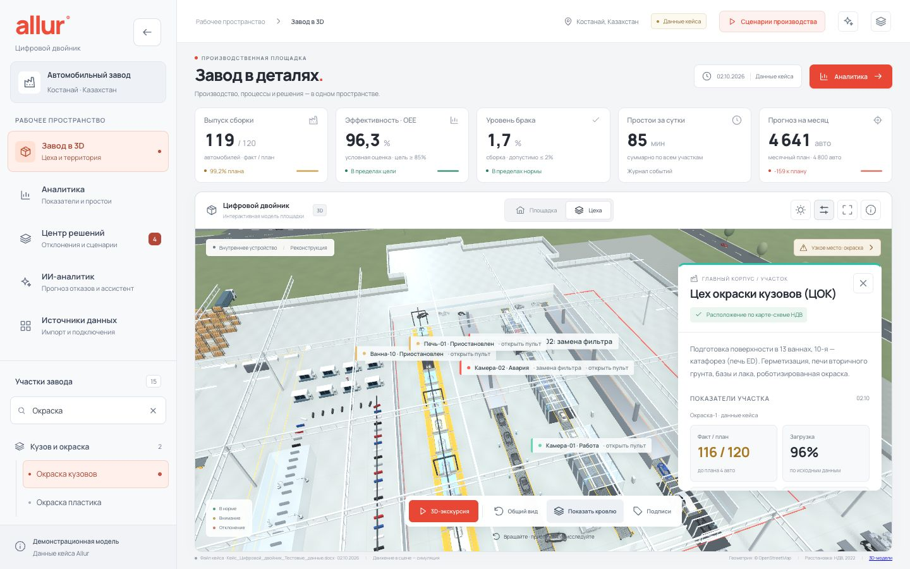
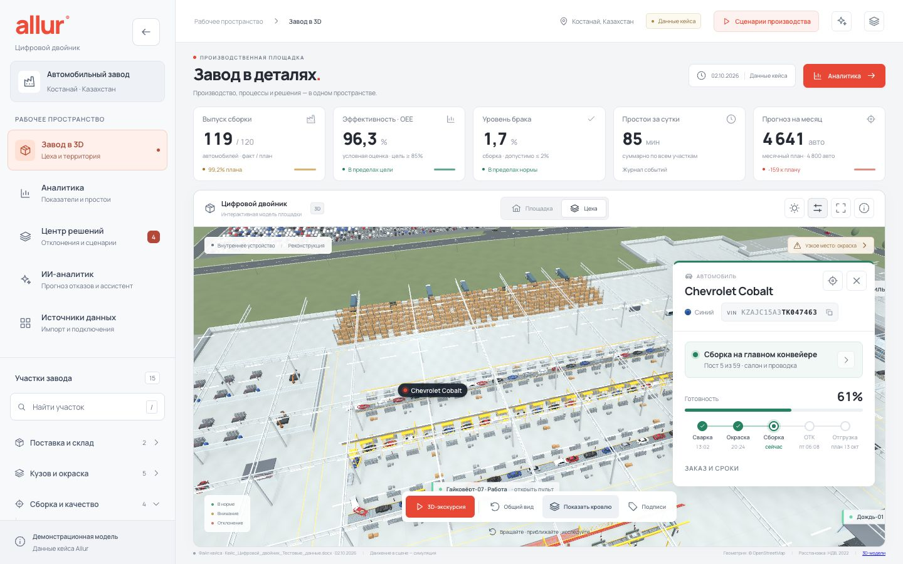
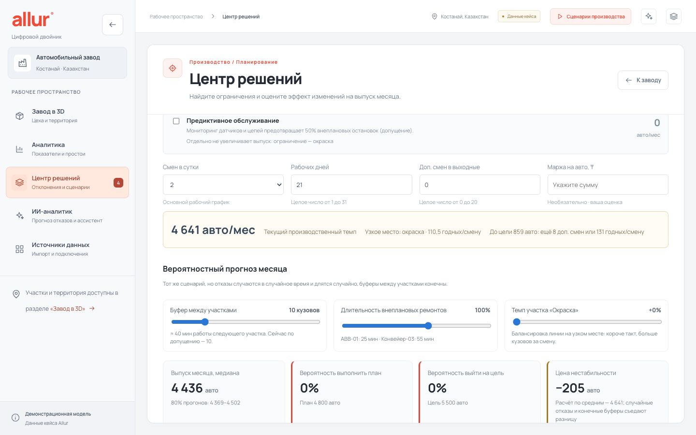
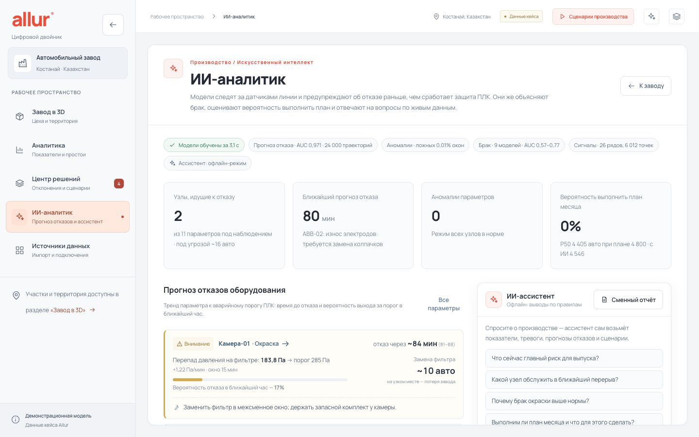
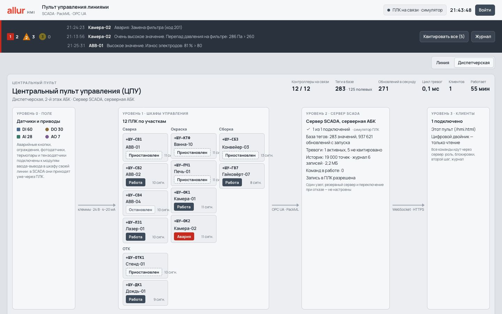
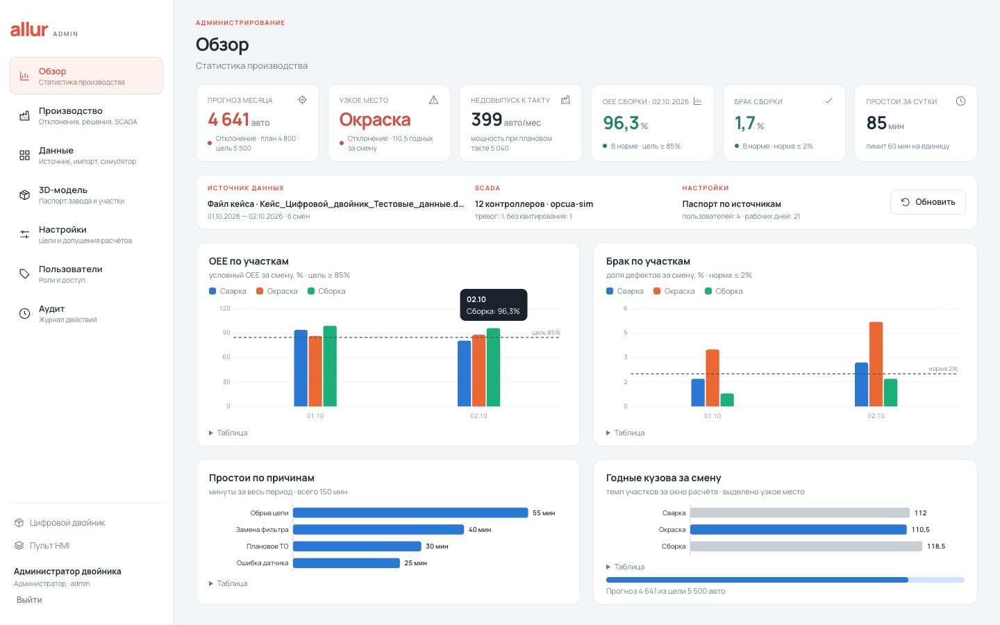

# Allur — цифровой двойник автомобильного завода

Кейс №2 Qostanai Industry Hackathon (АО «Группа компаний АЛЛЮР»). Интерактивная 3D-модель завода Allur
в Костанае (ул. Промышленная, 41), показатели производства, центр решений, сценарная симуляция смены
и управление контроллерами линий через SCADA/HMI.

Двойник отвечает на три вопроса руководителя: **что происходит на заводе**, **где он теряет автомобили**
и **что даст каждое решение** — в штуках за месяц, а не в процентах.

**Быстрый старт:** `docker compose up -d --build` — двойник на http://localhost:8080. Из исходников:
`pip install -r backend/requirements.txt` и `uvicorn app.main:app --app-dir backend --port 8000`, затем
`cd frontend && npm install && npm run dev` — http://localhost:5173. Подробно, с портами, учётками и разбором
ошибок — [docs/RUN.md](docs/RUN.md).

## Демонстрация

<video src="https://github.com/NuralyAb/allur/raw/main/docs/demo/allur-demo.mp4" controls width="100%"></video>

Запись работающего приложения — 4 минуты 30 секунд, без звука: пояснения вынесены в подписи на экране.
Если видео не проигрывается прямо здесь, [скачайте файл](docs/demo/allur-demo.mp4) — 8,8 МБ.

| ≈ Время | Глава | ≈ Время | Глава |
|---|---|---|---|
| 0:00 | Что это и на какие вопросы отвечает | 2:50 | Сценарная студия: вероятность выполнить план |
| 0:20 | Площадка: корпус по OpenStreetMap, цеха по НДВ | 3:00 | ИИ-аналитик: отказ за 80+ минут до аварии ПЛК |
| 1:05 | Живой поток: сварка, окраска, сборка, ОТК | 3:15 | Отказ конвейера и блокировка окраски |
| 1:50 | Карточка машины: VIN, пост, сроки отгрузки | 3:30 | Экономика: ремонт 55 → 20 минут |
| 2:20 | Узкое место: окраска, 110,5 при плане 120 | 3:40 | Пульт HMI и диспетчерская SCADA |
| 2:35 | Центр решений: эффект в автомобилях | 4:05 | Бизнес-кейсы, ценность, план пилота |

Текст презентации, бизнес-кейсы по ролям, раздел «Где деньги» и что требуется для пилота —
[docs/DEMO.md](docs/DEMO.md).

## Документация

README — обзор. Подробности разнесены по документам, каждый читается отдельно:

| Документ | О чём |
|---|---|
| [Запуск и проверки](docs/RUN.md) | Docker одной командой, запуск из исходников, порты, учётки, переменные окружения, тесты, разбор ошибок |
| [Деплой в Docker](docs/DEPLOY.md) | состав стека, переменные деплоя, состояние на томе и резервные копии, обновление и откат, HTTPS, выход на контроллеры завода |
| [Деплой в Docker](docs/DEPLOY.md) | состав стека, переменные деплоя, состояние на томе и резервная копия, обновление, HTTPS, выход на контроллеры завода |
| [Сценарии использования](docs/USE_CASES.md) | кто открывает двойник и с какой задачей, ход смены, демо на пять минут |
| [Демонстрация для инвесторов](docs/DEMO.md) | что умеет двойник, бизнес-кейсы по ролям, где деньги, чего в демо нет, план пилота |
| [Данные, расчёты и решения](docs/ANALYTICS.md) | откуда берутся числа, как читать KPI, узкое место и прогноз, сценарная студия, сценарии производства |
| [SCADA и HMI](docs/SCADA.md) | управление ПЛК линий: PackML по OPC UA, тревоги ISA-18.2, роли и аудит, подключение контроллера завода |
| [ИИ-аналитик](docs/AI.md) | прогноз отказов, аномалии режима, причины брака, вероятность выполнить план, ассистент |
| [3D-сцена](docs/SCENE.md) | управление камерой, интерьер по видео с завода, производительность, GLB-модели автомобилей |
| [Администрирование](docs/ADMIN.md) | цели и допущения, управление данными, паспорт завода, пользователи, журнал действий |
| [Архитектура и код](docs/ARCHITECTURE.md) | слои и правило зависимостей, путь данных до решения, таблица API, структура каталогов |
| [Журнал изменений](docs/CHANGELOG.md) | что менялось по шагам |
| [Материалы кейса](docs/case/) | условие и тестовые данные организаторов |

## Что внутри

- **Площадка с географической привязкой.** Контур главного корпуса (360 × 227 м, 85 197 м²), территории и
  соседних зданий взят из OpenStreetMap. Земля, покрытия, подъезды, бордюры и озеленение построены объёмной
  геометрией и локальными материалами. Положения открытых площадок сохранены, а дороги и благоустройство —
  иллюстративная реконструкция, не геодезический план.
- **Расстановка цехов — по документу завода.** В проекте нормативов допустимых выбросов (НДВ)
  ТОО «СарыаркаАвтоПром» 2022 года (публичные слушания на ecoportal.kz) у каждого из 48 источников выбросов
  указаны цех и координаты на карте-схеме. Карта-схема привязана к спутниковому снимку (OpenCV), точность ≈10–15 м.
  Так определены положения ЦСК (сварка), ЦОК (окраска, печи ED / грунта / базы и лака), цеха окраски пластика,
  концов сборочных линий Chevrolet и Kia (ТРК), ЦМУС, ЦУД, ЦСКТ, РИЦ, лаборатории и котельной.
  Результат привязки — `backend/app/data/ndv_sources.json`. Цеха без выбросов (склад CKD, ОТК, буфер кузовов)
  размещены по технологической логике; в карточке цеха видно, на чём основано его положение.
- **Оборудование:** 4 сварочные линии (лазерная сварка крыши Onix), 13 ванн окраски (№10 — катафорез),
  кабины грунта, эмали и лака, печи, окраска пластика (6 роботов), конвейер на 59 постов, ОТК
  (сход-развал, фары, тормозной стенд, дождевальная камера, световой туннель). Это реконструкция по описаниям
  технологического процесса, не заводские CAD-модели.
- **Живой поток:** кузова тактово идут по сварке, окунаются в ванны, меняют цвет при окраске, на сборке получают
  стёкла и колёса, проходят ОТК и уезжают на площадку. Автомобили — авторские GLB-модели Onix и Cobalt с тремя
  уровнями детализации.
- **KPI по данным кейса:** план/факт, загрузка, условный OEE, брак и простои; цели — OEE ≥ 85 %, брак ≤ 2 %.
- **Центр решений:** узкое место, потери в автомобилях, прогноз месяца, мероприятия с эффектом и сценарий «что если».
- **Источники данных:** файл кейса, импорт выгрузок MES/1С, живой симулятор линии, путь к ПЛК.
- **Сценарии производства:** дискретно-событийная модель смены — отказ конвейера, очереди, ремонт, сравнение сценариев.
- **Карточка машины:** клик по любому автомобилю в сцене — VIN, модель, цвет, заказ, участок и этап, сроки, что мешает.
- **SCADA/HMI:** управление 12 контроллерами линий по PackML через OPC UA, тревоги по ISA-18.2, журнал аудита,
  пульт оператора `/hmi.html`; тревоги ПЛК видны на 3D-модели. Устроено как на заводе: шкафы управления с ПЛК
  и 125 полевыми сигналами на клеммах, центральный сервер с базой тегов и экран диспетчерской с командами линии.
- **ИИ-аналитик:** прогноз отказов по трендам датчиков за десятки минут до аварии ПЛК, детектор аномалий режима,
  модель причин брака, вероятность выполнить план (Монте-Карло) и ассистент на OpenAI с инструментами только для чтения;
  прогнозы видны на 3D-модели и на пульте HMI.
- **3D-экскурсия** из 16 шагов с автопереходом; прямая ссылка на шаг: `?step=5`.
- **Админка** `/admin.html`: статистика с графиками, управление данными и симулятором, цели и допущения расчётов,
  правки паспорта завода для 3D-модели, пользователи и роли, журнал действий.

## Экраны

| | |
|---|---|
|  **Внутри корпуса.** Кровля снята: линии, роботы, конвейер на 59 постов, ОТК; метки отклонений над цехами. |  **Карточка участка.** Цех окраски кузовов: на чём основано его положение, описание процесса, факт/план и загрузка за смену; камера подлетает к цеху. |
|  **Карточка машины.** Клик по любому автомобилю в сцене: VIN, модель и цвет, пост на конвейере, маршрут по заводу со сроками и готовность. |  **Центр решений.** Прогноз месяца, узкое место, недовыпуск, мощность; поток по участкам и сценарий «что если». |
|  **Сценарная студия.** Медиана выпуска и разброс 80 % прогонов, вероятность плана и цели, цена нестабильности; буферы и ремонты — ползунками. |  **Аналитика.** Таблицы линий и качества, журнал простоев, план месяца, методика расчётов и неоднозначности данных. |
|  **ИИ-аналитик.** Метрики обученных моделей, прогноз отказа с временем и потерей в автомобилях, аномалии режима, ассистент по живым данным. |  **Сценарии производства.** Отказ Конвейера-03: сборка остановлена, буфер PBS заполняется, состояния оборудования в 3D. |
|  **Пульт HMI.** Лента тревог, схема линии, плитки 12 контроллеров с параметрами и состоянием PackML. |  **Диспетчерская.** Четыре уровня от клемм до клиентов: 12 ПЛК по участкам, сервер SCADA, база тегов, историк и журнал команд. |
|  **Админка.** Прогноз и узкое место, OEE и брак по участкам по дням с линиями целей, простои по причинам, годные кузова за смену. |  **Источники данных.** Откуда данные сейчас, живой симулятор, импорт XLSX/DOCX, шаблон, путь к ПЛК. |

**На телефоне** интерфейс сворачивается в одну колонку: показатели — горизонтальной прокруткой, навигация —
кнопкой меню, 3D-сцена управляется жестами. Проверены 1440 × 900, 1024 × 768, 1440 × 560 и 390 × 844.

 

## Ограничения

- Реальных данных завода нет: показатели — тестовые данные кейса за два дня, симуляторы — имитация по их профилю.
- Условный OEE и допущения центра решений (одна строка = смена, 21 рабочий день, 50 % предотвращённых простоев)
  требуют уточнения на заводе.
- Смена в «Сценариях производства» — иллюстративная модель со своими тактами; месяц везде считает единое ядро прогноза.
- Распределение отказов (пуассоновский поток, логнормальная длительность), ёмкость буферов и стоимость мероприятий — допущения;
  на двух днях данных частоты отказов грубые и уточняются с ростом истории.
- Оборудование в сцене и позиции контроллеров условные; GLB конвейера и JAC J7 не подключены.
- Модели ИИ обучены на синтетических данных из модели оборудования двойника; на заводе их нужно дообучить
  на журнале простоев и паспортах кузовов с результатами ОТК. Сроки ремонта для перевода в автомобили — оценка.
- SCADA проверена только с симулятором ПЛК; коннектор для записи смен из ПЛК в хранилище показателей — следующий шаг.
- Сессии симуляции живут в памяти одного процесса API.

## Источники

- OpenStreetMap, way [164635123](https://www.openstreetmap.org/way/164635123) — корпус Allur; way 164635178 — территория
- [nur.kz — как выпускают автомобили на заводе Allur](https://www.nur.kz/nurfin/economy/2126985-melkouzlovaya-sborka-i-vysokotochnye-ispytaniya-kak-vypuskayut-legkovye-avtomobili-na-avtomobilnom-zavode-allur/)
- [nur.kz — От импорта к локализации](https://special.nur.kz/madeinkz-allur)
- [Tengrinews — лазерная сварка на Allur](https://tengrinews.kz/kazakhstan_news/novyie-robotyi-poyavilis-avtomobilnom-zavode-allur-kostanae-516740/)
- [Википедия — Allur](https://ru.wikipedia.org/wiki/Allur)
- [Проект НДВ ТОО «СарыаркаАвтоПром», 2022 — ecoportal.kz](https://ecoportal.kz/Public/PubHearings/PublicHearingDetail?hearingId=8996)
