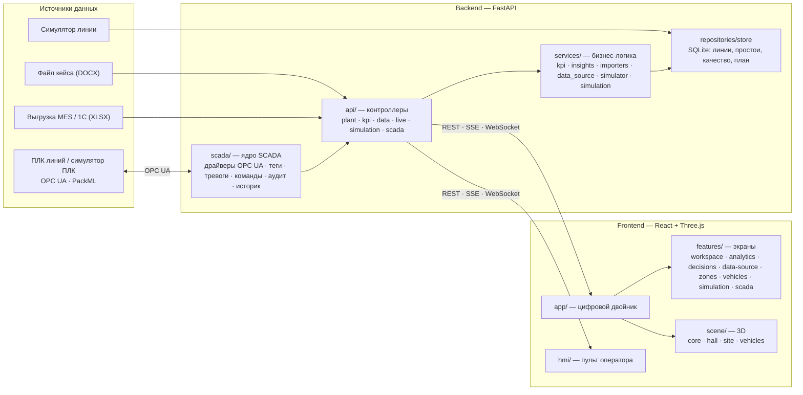
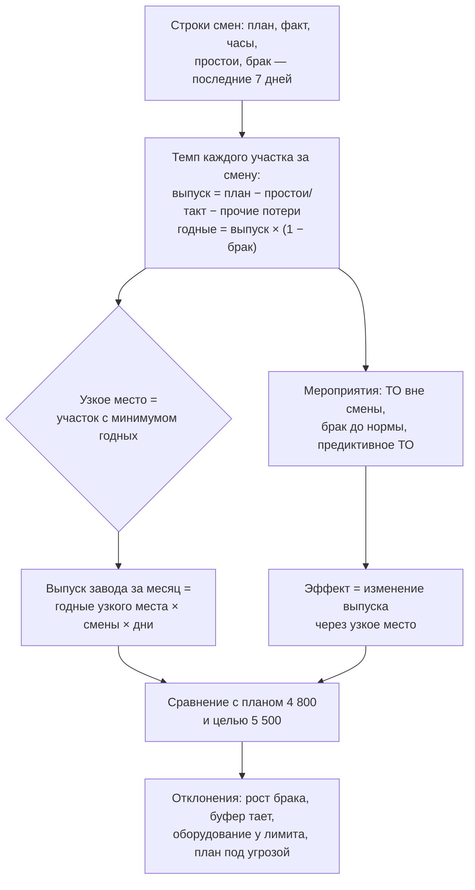

# Архитектура и код

[← Обзор проекта](../README.md)

Слои бэкенда и фронтенда, правило зависимостей, путь данных от источника до решения, таблица API
и структура каталогов.

## Слои и зависимости



Правило зависимостей: контроллеры вызывают сервисы, сервисы — хранилище; экраны фронтенда пользуются `shared/`
и не зависят друг от друга; 3D-сцена ничего не знает об экранах. Любой новый источник данных (например,
коннектор OPC UA для записи смен) пишет в то же хранилище, и все расчёты работают без изменений.

### Как считается решение



## API

| Маршрут | Назначение |
|---|---|
| `GET /api/health` | проверка живости |
| `GET /api/site`, `GET /api/plant` | геометрия площадки; паспорт завода, зоны, факты, система координат корпуса |
| `GET /api/kpi` | показатели линий, OEE, план месяца |
| `GET /api/insights`, `POST /api/scenario` | узкое место, отклонения, риски, мероприятия; прогноз при выбранном сценарии |
| `GET /api/forecast/model`, `POST /api/forecast`, `GET /api/forecast/sensitivity`, `POST /api/forecast/plan` | сценарная студия: калибровка; распределение выпуска месяца и вероятность плана и цели; эффект мероприятий; самые дешёвые планы выхода на цель |
| `GET /api/data/source`, `POST /api/data/import`, `POST /api/data/reset`, `GET /api/data/template` | источник данных, импорт XLSX/DOCX, сброс к файлу кейса, шаблон |
| `POST /api/live/{start\|stop}`, `GET /api/stream` | живой симулятор линии; поток событий SSE |
| `POST /api/simulation/sessions`, `GET …/{id}`, `POST …/{id}/control`, `WS …/{id}/stream`, `POST /api/simulation/compare` | сценарная смена: сессия, состояние, команды, поток, сравнение сценариев |
| `/api/scada/*` | конфигурация, состояние, тревоги, вход, команды с подтверждением, команды линии, квитирование, история, аудит, события, сводка сервера, база сигналов, поток — таблица в [docs/SCADA.md](SCADA.md) |
| `/api/ai/*` | `status` (модели и метрики), `maintenance` (прогноз отказов, аномалии, демо-сценарии), `quality`, `forecast`, `scene` (сводка для 3D), `POST chat`, `POST report`, `POST demo` |
| `/api/admin/*` | вход администратора (`login`, `logout`, `me`), сводка `overview`, `settings` (GET/PUT/DELETE), `plant` (GET/PUT/DELETE), `users` (GET/POST/PATCH/DELETE, смена пароля), `audit` |

Схема OpenAPI: http://localhost:8000/docs.

## Структура кода

```
backend/app/
  main.py          точка входа: create_app(), CORS, lifespan, подключение роутеров
  config.py        пути и переменные окружения (TWIN_DB, файл кейса, каталоги данных)
  api/             контроллеры — роутеры FastAPI по областям:
                   health, plant, kpi (kpi, insights, scenario), forecast (сценарная студия), data (source, import, reset, template),
                   live (live/*, stream), simulation (сценарные смены), scada (/api/scada/*), admin (/api/admin/*)
  schemas/         Pydantic-схемы запросов: kpi (Scenario), forecast (ForecastRequest, PlanRequest), simulation (SimulationControl), scada (команды, тревоги), admin
  services/        бизнес-логика: plant (паспорт завода), kpi (OEE и сводка), insights (узкое место, прогноз,
                   сценарии, риски), forecast (сценарная студия: калибровка, Монте-Карло, чувствительность, подбор плана), importers (DOCX/XLSX кейса, шаблон), data_source (источник данных, импорт,
                   сброс, live), simulator (живой симулятор линии), simulation (дискретно-событийная модель смены),
                   settings (цели, допущения, сцена, правки паспорта), accounts (учётные записи и вход администратора)
  repositories/    store — хранилище SQLite: линии, простои, качество, план месяца, настройки, аудит
  ai/              модели ИИ: engine (сбор сигналов из SCADA, обучение, кэш прогнозов), maintenance (прогноз отказа,
                   аномалии), quality (причины брака), forecast (Монте-Карло), assistant (OpenAI), service (отчёты)
  scada/           подсистема SCADA: runtime (запуск симулятора ПЛК и OPC UA-сервера, сессии), core (тревоги,
                   команды, аудит, историк), drivers (OPC UA), packml, registry (реестр ПЛК), auth (роли), plcsim
  data/            site.json (геометрия из OSM), ndv_sources.json (источники НДВ), controllers.json (реестр ПЛК),
                   scada_users.json (демо-учётки)
backend/tests/     unittest: kpi, insights, data, simulation, forecast, scada, ai, admin
backend/tools/     build_site.py — пересборка site.json из OpenStreetMap (Overpass API)
backend/.env.example  секреты локального запуска: OPENAI_API_KEY (сам .env в .gitignore)
frontend/src/
  app/             точка входа двойника (index.html): main.tsx, App.tsx — композиция экранов, styles.css
  hmi/             пульт оператора (hmi.html): HmiApp, Faceplate, Trend
  admin/           админка (admin.html): обзор с графиками, производство, данные, редактор паспорта, настройки, пользователи, аудит
  features/        экраны и их логика:
                   workspace (TopBar, ZoneList, TourBar, общие стили панелей), analytics (аналитика, строка смены),
                   decisions (центр решений), data-source (источник данных), zones (карточка участка),
                   vehicles (карточка машины, паспорт), simulation (сессия сценарной смены, панель, часы),
                   scada (клиент SCADA, контроллеры участка, элементы пульта), ai (раздел «ИИ-аналитик»)
  scene/           3D: Scene.tsx — сборка сцены и ракурсы;
                   core (свет, подписи, зоны, геометрия координат, экскурсия, материалы, движение),
                   hall (корпус и цеха: сварка, окраска, сборка, логистика, службы, роботы, рабочие),
                   site (территория, стоянки, дороги), vehicles (модели машин, парк, GLB и уровни детализации)
  shared/          общее: api (клиент и вызовы API двойника), types (типы API), hooks (useLive, useElementHeight),
                   lib (форматы), ui (Icon, SceneBoundary)
frontend/scripts/  установка и проверка GLB-моделей; frontend/e2e — Playwright
docs/              CHANGELOG.md — журнал изменений; SCADA.md — архитектура управления, безопасность, подключение
                   ПЛК завода; case/ — условие кейса (PDF) и тестовые данные (DOCX); screenshots/ — экраны для README
docker-compose.yml  развёртывание: контейнер API и nginx со статикой; .env.example — порты и ключи для compose,
                   backend/Dockerfile, frontend/Dockerfile, frontend/nginx.conf (прокси /api, WebSocket, SSE)
```
