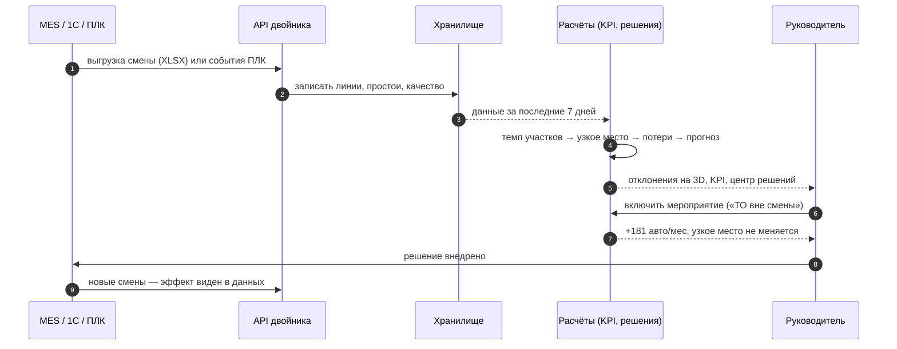

# Сценарии использования

[← Обзор проекта](../README.md)

Кто открывает двойник, с какой задачей и что получает; ход смены от выгрузки данных до решения
и сценарий показа на пять минут.

| Роль | Задача | Где в двойнике | Что получает |
|---|---|---|---|
| Директор по производству | Утром понять, выполняется ли план месяца и что мешает | Центр решений | Прогноз 4 641 авто при плане 4 800, узкое место — окраска, список отклонений, эффект каждого мероприятия в автомобилях |
| Начальник цеха | Найти, где теряется выпуск, и проверить оборудование у лимита простоя | Завод в 3D → карточка участка, Аналитика | Подсветка участка на модели, OEE и брак по дням, журнал простоев, риск оборудования и рекомендуемое действие |
| Мастер смены | Увидеть, что остановилось прямо сейчас | 3D-модель, живой поток, HMI | Метка «Простой: Камера-02» над цехом, ход смены по участкам, тревога ПЛК с причиной |
| Оператор линии | Запустить, остановить или сбросить контроллер, квитировать тревогу | Пульт `/hmi.html` | Панель контроллера PackML с проверкой блокировок, вторым шагом подтверждения и журналом аудита |
| Планировщик | Оценить, хватит ли мощности на цель 5 500 | Центр решений → «Что если» | Мощность при плановом такте 5 040, сколько доп. смен нужно, перевод эффекта в тенге по заданной марже |
| Инженер по надёжности | Проверить, что даст ускорение ремонта конвейера | Сценарии производства → «Что если?» | Сравнение ремонта 55 и 20 минут: 113 → 122 годных за смену, месяц 5 327 → 5 769, экономика |
| Логист / отдел продаж | Узнать, где конкретная машина и когда уедет дилеру | Клик по машине в 3D | VIN, заказ, этап, плановая отгрузка, просрочка и причина задержки |
| Аналитик данных | Подключить реальные данные без интеграции | Источники данных | Шаблон XLSX, импорт выгрузки MES/1С, автоматический пересчёт KPI и решений |
| Администратор | Задать цели и допущения, поправить паспорт завода, завести пользователей | Админка `/admin.html` | Графики по участкам, контроль SCADA и симулятора, настройки, редактор участков 3D-модели, роли, аудит |

## Как это работает на смене

## Демо-сценарий на пять минут

1. **Завод в 3D.** Корпус и цеха стоят по спутнику и документам НДВ; над окраской — метка «Узкое место».
2. **Центр решений.** Завод теряет 399 авто в месяц на окраске. Включаем «Плановые работы — вне смены»: +181 авто.
   Включаем «Брак окраски до 2 %»: +63, и узкое место переходит на сварку. Снижение брака сварки отдельно даёт 0:
   двойник показывает, куда *не* стоит вкладываться ради объёма.
3. **Источники данных → «Запустить live».** Смена проходит за 24 секунды, на модели загорается «Простой: Камера-02»,
   после смены прогноз пересчитывается.
4. **Сценарии производства → «Показать отказ».** Конвейер-03 встал, буфер перед сборкой заполняется, окраска
   блокируется, ОТК без подачи; «Что если?» сравнивает ремонт за 55 и 20 минут.
5. **Пульт HMI.** Оператор видит тревогу, квитирует её, перезапускает конвейер; тревога ПЛК одновременно видна на 3D-модели.
